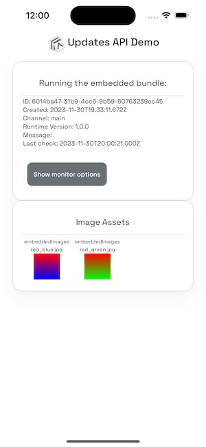
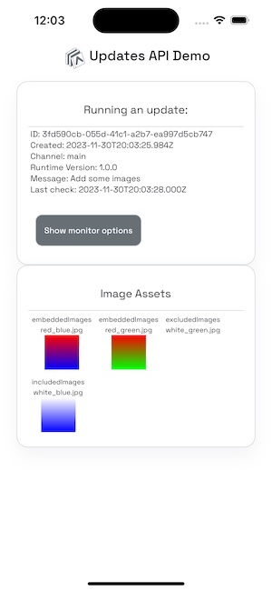

## expo-updates asset selection demo

- See also the [Expo documentation guide to asset selection](https://docs.expo.dev/eas-update/asset-selection/)

### Introduction to asset selection

In SDK 49 and earlier, all assets resolved in the Metro bundler are included in every update, and are uploaded to the update server. The new experimental asset selection feature in SDK 50 allows the developer to specify that only certain assets should be included in updates. This has the potential to greatly reduce the number of assets that need to be uploaded to and downloaded from the updates server.

To use this feature, a new property `extra.updates.assetPatternsToBeBundled` should be included in your Expo config. It should define one or more file matching patterns (regular expressions). For example, suppose your `app.json` file has the patterns defined this way:

```json
    "extra": {
      "updates": {
        "assetPatternsToBeBundled": [
          "app/images/**/*.png"
        ]
      }
    }
```

In this case, all `.png` file in all subdirectories of `app/images` would be included in updates.

Assets that do not match any of the file patterns will still resolve in the Metro bundler, but will not be uploaded to the updates server. If making use of this feature, a developer needs to be certain that assets not included in updates are built into the native build of the app.

If this new property is not in your Expo config, all assets resolved by the bundler will be included in updates (SDK 49 and earlier behavior).

### Quick start

This demo makes use of a component that displays image assets. To initialize this component with the default images from `app/embeddedImages`, execute

```bash
yarn select-images
```

Then follow the quick start instructions in the [README](./README.md) document to do an initial build of the app:

```bash
yarn
eas init
eas update:configure
# Build and run iOS
npx expo run:ios --configuration Release
# Or build and run Android
npx expo run:android --variant release
```

### Embedded assets

The build will include two image files, both in the `app/embeddedImages` folder. These assets will be available to the initial build, and to all subsequent updates. When running the initial build, you will see these two images in the "Image Assets" card on the home screen.



### Assets included in updates

This app has a folder `app/includedImages`. The Expo config for the app contains an `extra.updates.assetPatternsToBeBundled` setting so that only images in this folder are included in updates.

#### Add images and create an update

You can now use the `select-images` script to add images to the asset imports in `app/components/ExpoAssets/assets.ts`. All the images you add will be resolved by the Metro bundler, but only assets in `app/includedImages` will be packaged into updates.

While the app is running in the simulator/emulator, execute

```bash
# Add all JPG images in the app folder to assets.ts
yarn select-images app/*/*.jpg
# Execute an EAS update
yarn update -m "Add some images"
```

In the app, click "Show monitor options", then check the checkbox labeled "Check every 10 seconds". After a few seconds, the monitor will show at the bottom of the screen, alerting the user that an update is available, and some details about the update, including the message from `app.json`.

Click "Download" to fetch the update, and "Launch" to restart the app with the new update bundle.

The "Image Assets" card on the home screen now shows the original images from the `app/embeddedImages` folder. A new image is now included from the `app/includedImages` folder -- this folder is included in the asset selection patterns in `app.json`. The app attempts to show another new image in `app/excludedImages`. This image is resolved by the Metro bundler, but not included in the update or in the original app build, so the image does not show on the screen.



#### Checking locally to ensure that all needed assets are included in an update

Since it is desirable to check for missing images before an update is published, a command has been added to the `expo-updates` CLI to allow users to make this check:

```
$ npx expo-updates assets:verify --help

Description
Verify that all static files in an exported bundle are in either the export or an embedded bundle

Usage
  $ npx expo-updates assets:verify <dir>

  Options
  <dir>                                  Directory of the Expo project. Default: Current working directory
  -a, --asset-map-path <path>            Path to the `assetmap.json` in an export produced by the command `npx expo export --dump-assetmap`
  -e, --exported-manifest-path <path>    Path to the `metadata.json` in an export produced by the command `npx expo export --dump-assetmap`
  -b, --build-manifest-path <path>       Path to the `app.manifest` file created by expo-updates in an Expo application build (either ios or android)
  -p, --platform <platform>              Options: ["android","ios"]
  -h, --help                             Usage info

```

> Eventually, we plan to use this command as part of the `eas update` flow so that EAS will automatically verify that updates have all assets that they need.

To ensure that the command produces valid results, you will need access to the `app.manifest` file generated in Android and iOS builds where `expo-updates` is enabled. This file lists all assets that were resolved by Metro and included in the app during the build.

This check also requires files from the update bundle, specifically the `metadata.json` and `assetmap.json` in the update bundle. When making this check locally during application development, you can at any time generate the same bundle used by EAS Update (or a custom update server) by executing `npx expo export --dump-assetmap`.

For convenience, this demo app includes scripts in `package.json` that execute the above command to generate the update bundle, then perform the check against a local build. The scripts assume that you have built the app locally with `yarn ios --configuration Release` or `yarn android --variant release`.

For example, if we have followed the instructions above to select all images in the `app/` directory, and published an update, there is a single image missing from the update. If we run the demo script, this missing image is detected by the `expo-updates` CLI tool, and the tool returns exit code 1, indicating the missing image error:

```
$ yarn verify-assets:ios
yarn run v1.22.19
$ npx expo export --dump-assetmap -p ios; npx expo-updates assets:verify --build-manifest-path ios/build/Build/Products/Release-iphonesimulator/EXUpdates/EXUpdates.bundle/app.manifest --exported-manifest-path dist/metadata.json --asset-map-path dist/assetmap.json --platform ios
Starting Metro Bundler
iOS Bundled 5856ms (node_modules/expo/AppEntry.js)
iOS node_modules/expo/AppEntry.js ▓▓▓▓▓▓▓▓▓▓▓▓▓▓▓▓ 100.0% (997/997)
Processing asset bundle patterns:
- /Users/dlowder/iosProjects/UpdatesAPIDemo/app/includedImages/*
Creating asset map

Exporting 1 asset:
app/includedImages/white_blue.jpg (585 B)

Exporting 1 bundle for ios:
_expo/static/js/ios/AppEntry-5836bef8d94817a16949a9170d9bf03e.hbc (2.74 MB)

Exporting 2 files:
assetmap.json (13 kB)
metadata.json (207 B)

App exported to: dist
Error: 1 assets not found in either embedded manifest or in exported bundle:[
  {
    "hash": "3808fd53e4ab4bab04593285ef76bed0",
    "path": "/Users/dlowder/iosProjects/UpdatesAPIDemo/app/excludedImages/white_green.jpg"
  }
]
error Command failed with exit code 1.
```
