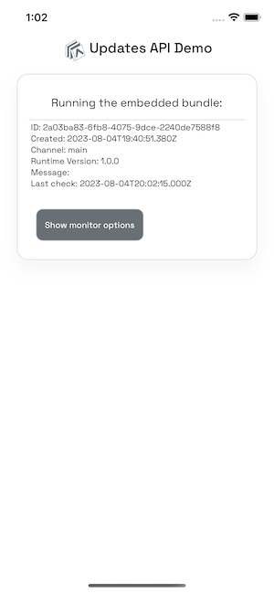
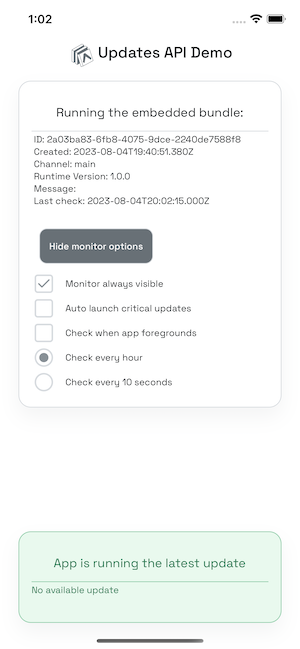
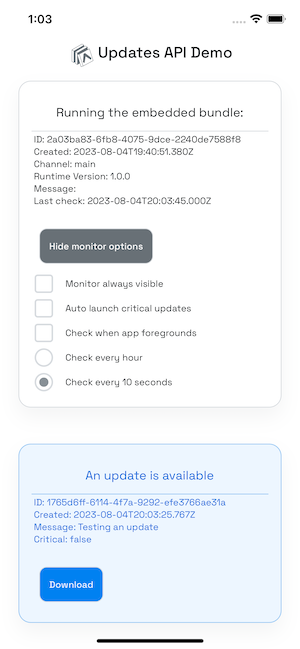
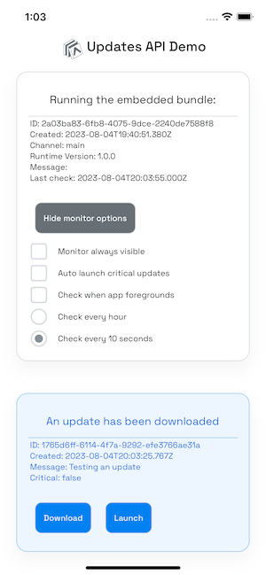
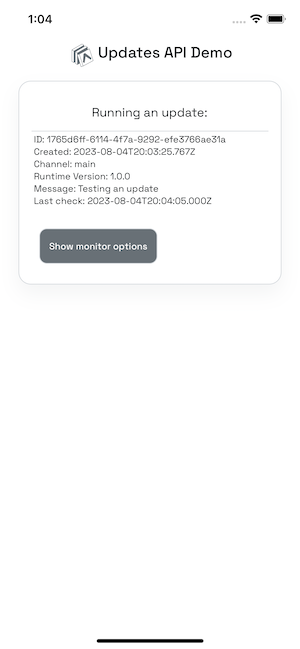
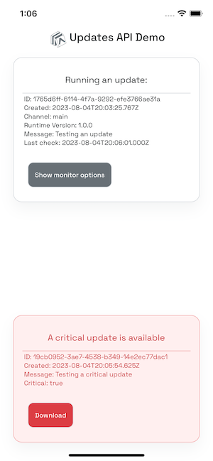

## Updates API demo

https://github.com/expo/UpdatesAPIDemo/assets/6577821/a3a23f7d-bce6-4f75-b953-d3105deb8601

App to test out

- Features provided by `expo-updates`
- Example solutions for some use cases
- Uses the [Updates JS API](https://docs.expo.dev/versions/latest/sdk/updates/#useupdates) introduced in SDK 50
- Uses the [expo-updates asset selection feature](./ASSETSELECTION.md) introduced in SDK 50

Built using the [Ignite React Native boilerplate CLI](https://github.com/infinitered/ignite)

### Quick start

#### Setup

```bash
yarn
eas init
eas update:configure
```

Then you can build locally or build with EAS

#### Build with EAS

```bash
eas build:configure
# Build for iOS simulator
eas build -e preview -p ios
# Build for Android emulator
eas build -e preview -p android
```

Then download and run the build on your simulator/emulator.

#### Build locally

```
# Build and run iOS
npx expo run:ios --configuration Release
# Build and run Android
npx expo run:android --variant release
```

### Using the app

After starting for the first time, see that the app is running from built-in code. Click "Show monitor options", then toggle "Monitor always visible" to show the monitor's banner view, showing that there are no available updates.

 

_Note:_ If you are running the app for the first time, after building locally, you may see a "There is no channel named main..." error message; this is expected.

### Push an update

```bash
yarn update --message "Testing an update"
```

(This runs a script that manually modifies `app.json` to add a custom `message` string property in the `extra` section, and then runs `eas update`. Doing this results in an update manifest that contains the custom message in the `extra` section of the `expoClient` object.)

Click "Show monitor options", then check the checkbox labeled "Check every 10 seconds". After a few seconds, the monitor will show at the bottom of the screen, alerting the user that an update is available, and some details about the update, including the message from `app.json`.



Click "Download" to fetch the update, and "Launch" to restart the app with the new update bundle.

 

### Check for updates when the app foregrounds

Enable the "Check when app foregrounds" toggle. Now push another update using a `yarn update` command as above. In the simulator, navigate back to the home screen, and then click on the app icon to bring it back to the foreground. The monitor code will check the update server and show that a new update is available.

### Automatic updates

Force quit the app, and then issue a `yarn update` command like the one above, to run EAS Update again and upload a new update bundle to the server. Now start the app. Since the `expo-updates` module has the default configuration for automatic updates, it will query the server on startup, see that there is an update, and download it. Therefore, the monitor will immediately show that a new update has been downloaded. Click "Launch" to load and run the new update. If a bundle is downloaded, it will also be automatically launched the next time the app cold starts.

### Push a critical update

```bash
yarn update --message "Testing a critical update" --critical
```

This is implemented by having a counter saved in the file `.criticalIndex`. The value is added to the Expo config in the `expo.extra` section, exactly as is done for the `message` value above. If the `--critical` flag is passed into the `yarn update` script, this counter is incremented by 1.

The demo app code looks for this custom property, and compares it to the same property in the manifest of the currently running update (or embedded manifest). If the value has changed, the update is treated as critical.

Again, click "Show monitor options", and check the checkbox near the bottom of the screen labeled "Check at 10 second intervals".
The monitor will now show that a critical update is available.



Now enable the "Download and launch critical updates" toggle. On the next check for updates, the monitor will immediately download and launch the new update without manual intervention.

> _Note:_ Implementing critical updates in this way ensures that if update 1 is critical, and update 2 is not, a device that does not run the app until after update 2 goes out will still see that the counter has changed, and know that a critical update has been pushed since the last time it checked for updates.

### Notes on the demo app code:

_[UpdatesApiDemoScreen.tsx](./app/screens/UpdatesApiDemoScreen.tsx):_

- Uses the `currentlyRunning` object from the `useUpdates()` hook to display info about the running application.
- Uses the `isChecking` and `isDownloading` boolean properties from the `useUpdates()` hook to show an `ActivityIndicator` when the Updates module is making requests to the server.
- Shows `lastCheckForUpdateTime` to indicate the last time the app has made a request to the update server. This uses the `lastCheckForUpdateTimeSinceRestart` property returned from the `useUpdates()` hook.

_[UpdateMonitor.tsx](./app/components/UpdateMonitor.tsx):_

- Checks for updates using `checkForUpdateAsync()`, either at a set interval, or on app foregrounding using the React Native `AppState` API.
- Downloads using `fetchUpdateAsync()`.
- Uses `isUpdateAvailable`, `isUpdatePending`, and `availableUpdate` from the `useUpdates()` hook to show information on any new update available on the server, and whether it has already been downloaded.
- Checks to see if the update is critical (see details above).
- If automatic download and launch of "critical" updates is enabled, downloads and launches the update.

_[updateUtils.ts](./app/utils/updates/updateUtils.ts):_

- Convenience methods used by components to generate display information for the currently running app, for updates, and for errors, and code to decide if an update is "critical".

_[useAppState.ts](./app/utils/updates/useAppState.ts):_

- Wrapper around the React Native core `AppState` API.

_[useInterval.ts](./app/utils/updates/useInterval.ts):_

- Implements the `useInterval()` hook to allow checking for an update at intervals.

_[usePersistentDate.ts](./app/utils/updates/usePersistentDate.ts):_

- Uses `AsyncStorage` to persist the last check time provided by the `useUpdates()` hook.
